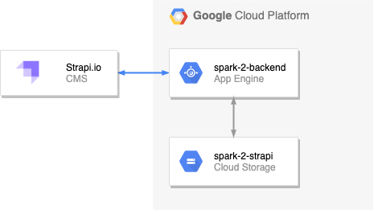

# Spark 2 Backend

A content management system based on the Strapi.io framework and hosted on the Google Cloud Platform (App Engine + Cloud Storage).
\
\


## Admin Panel
The admin panel allows for adding, updating and removing content and can be found at [cms.gylley.co.uk/admin](https://cms.gylley.co.uk/admin).

## API
The Strapi.io framework delivers content as REST or GraphQL API. For example, below endpoint returns all entries within the article collection:
```
GET https://cms.gylley.co.uk/articles
```

## Jamstack
This project makes use of a modern architecture design known as Jamstack. Technologies in the stack include JavaScript frameworks, Static Site Generators, Headless CMSs and CDNs. For reference: [jamstack.org](https://jamstack.org/).
\
\
